# GITRON Pixel Art

Here are a few pixel art I draw for this small web app.

## Fighting Characters

Old grid programs | New grid programs | ISOs
------------------|-------------------|-----
data pusher old | data pusher new | iso female
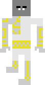 |  | 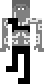
data pusher old | data pusher new | iso male
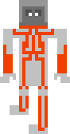 | 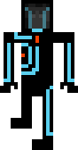 | 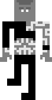
data pusher old | damaged program | iso male
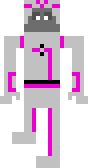 | 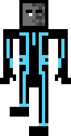 | 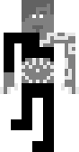
Dumont | Perl | iso male
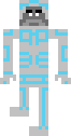 | 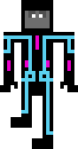 | 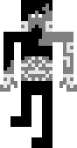
Guard | Black Guard | iso female
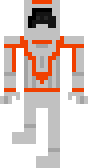 | 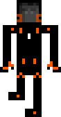 | 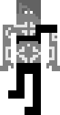
Sark's Lieutenant | Paige | old iso male
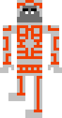 | 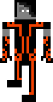 | 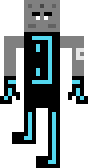
Ram | Dyson | young iso female
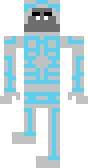 | 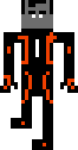 | 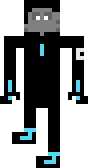
Yori | Jarvis | young iso male
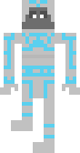 | 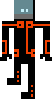 | 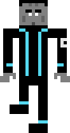
Clu 1.0 | Sam Flynn | Calchas
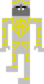 | 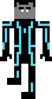 | 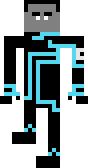
Kevin Flynn (red) | Rinzler (red) | Ada
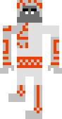 |  | 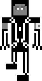
Kevin Flynn (blue) | Rinzler (blue) | Quorra
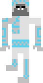 | 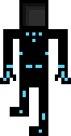 | 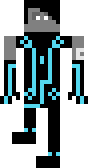
Sark | Clu 2.0 | Giles
 | 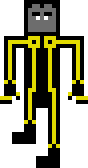 | 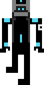
Tron | Tron (Uprising) | Ophelia (Radia)
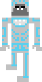 | 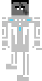 | 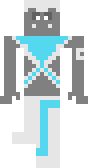

## Special Fighting Characters

Tron 2.0 | Tron (1982) | Tron: Legacy
---------|-------------|-------------
Jet Bradley | Master Control Program | Kevin Flynn
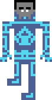 |  | 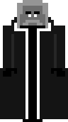

## Identity disc

New grid | Old grid | Special
---------|----------|--------
 |  | 
 |  | 
 | |

## BIT

Steady | False | true
-------|-------|-----
 |  | 

## Other Characters

Castor| Flynn | Infection
------|-------|----------
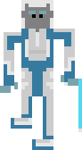 | 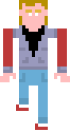 | 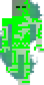 

## Logo

Recognizer | Logo 1 | Logo 2 | Loading
-----------|--------|--------|--------
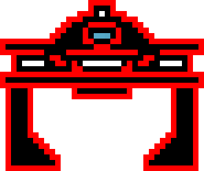 |  | 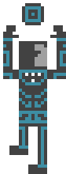 | 

## License

All rights reserved for images and assets inside `./img/` directory.

_don't you dare making an NFT out of these! :)_